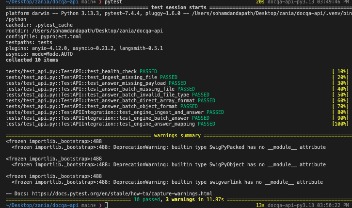

# DocQA - Documentation Question Answering System
A production-ready **Retrieval-Augmented Generation (RAG)** system for querying documents using LLM.

## Overview

DocQA is organized as a **monorepo** with two main components. It uses:

1. **`docqa/`** - Core RAG engine library- **LangChain** for RAG pipeline orchestration
   - Document processing and chunking- **FAISS** for vector similarity search
   - Vector search with FAISS- **FastAPI** for the REST API
   - LLM-powered QA pipeline- **OpenAI (gpt-4o-mini)** or **Ollama** for LLM inference
   - Multi-provider LLM support (OpenAI, Ollama)- **Nomic Embed Text** for document embeddings

2. **`docqa-api/`** - REST API server
   - FastAPI-based HTTP endpoints
   - Document ingestion endpoints
   - Single and batch question answering

## Test
